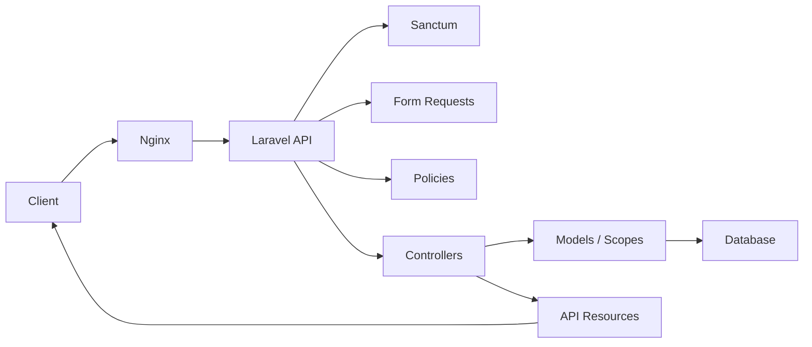
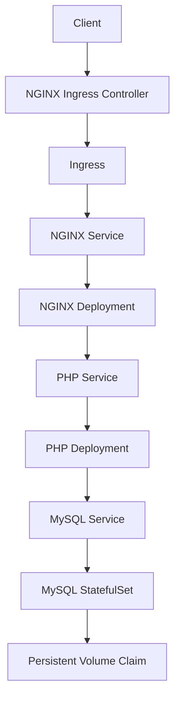
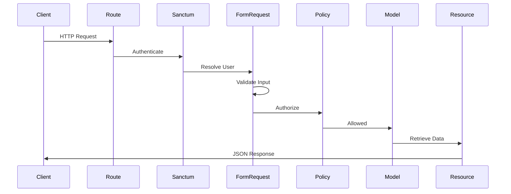
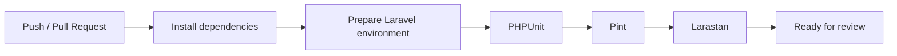
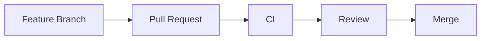

# CareerTrack API

> A REST API for tracking job applications with user-scoped data, documented endpoints, automated quality checks, and a reproducible development environment.

[](../../actions/workflows/ci.yml)


CareerTrack API centralizes the job application workflow behind a structured HTTP interface.

It is designed as a focused backend service: authenticated, user-scoped, validated, tested, documented, and ready to run locally with Docker.

|  |  |
| --- | --- |
| **Domain** | Job application tracking |
| **Interface** | REST API |
| **Authentication** | Bearer tokens with Laravel Sanctum |
| **Documentation** | OpenAPI generated with Scramble |
| **Local runtime** | Docker Compose with PHP-FPM, Nginx, and MySQL |
| **Quality gates** | PHPUnit, Larastan, Laravel Pint, GitHub Actions |

## Product Summary

Job applications are often tracked across spreadsheets, notes, inboxes, and memory.

CareerTrack API provides a small, explicit backend for that workflow:

- Keep applications in one place.
- Track status changes over time.
- Store source, salary range, notes, dates, and next steps.
- Retrieve user-scoped statistics.
- Keep each user's data isolated.

## Project Highlights

| Area | Implementation |
| --- | --- |
| API design | RESTful routes with JSON responses |
| Authentication | Token-based access with Laravel Sanctum |
| Authorization | Ownership enforced through policies |
| Validation | Form Requests for input rules and request authorization |
| Serialization | API Resources for stable response payloads |
| Querying | Validated filters, sorting, and pagination |
| Documentation | OpenAPI documentation generated from the Laravel app |
| Development | Dockerized PHP-FPM, Nginx, and MySQL environment |
| Quality | CI, automated tests, static analysis, and style checks |

## Architecture Overview



## Features

### Authentication

| Capability | Endpoint |
| --- | --- |
| Register user | `POST /api/auth/register` |
| Login user | `POST /api/auth/login` |
| Logout current token | `POST /api/auth/logout` |

### Job Applications

- Create, list, view, update, and delete applications.
- Enforce ownership for user-specific records.
- Track status through a PHP enum.
- Store optional salary range, source, notes, location, and dates.
- Support partial updates through `PATCH`.

### Filtering and Pagination

The application listing supports validated query parameters.

| Parameter | Purpose |
| --- | --- |
| `status` | Filter by application status |
| `company` | Filter by company name |
| `from` | Filter by application date lower bound |
| `to` | Filter by application date upper bound |
| `sort_by` | Sort by allowed fields |
| `sort_direction` | Sort ascending or descending |
| `per_page` | Control page size within validation limits |

Paginated responses use Laravel's standard JSON structure:

- `data`
- `links`
- `meta`

### Statistics

The statistics endpoint returns authenticated-user data only.

| Metric | Description |
| --- | --- |
| `total` | Total applications for the current user |
| `by_status` | Count grouped by application status |
| `upcoming_next_steps` | Count of future next-step dates |

## Quick Start

### Docker

Requirements:

- Docker
- Docker Compose

```bash
cp env.docker.example .env
docker compose up -d
docker compose exec app composer install
docker compose exec app php artisan key:generate
docker compose exec app php artisan migrate
```

Open:

```text
http://localhost:8080
```

### Local Development

Requirements:

- PHP 8.3
- Composer
- Configured database connection

```bash
composer install
cp .env.example .env
php artisan key:generate
php artisan migrate
php artisan serve
```

Open:

```text
http://localhost:8000
```

## Kubernetes Deployment

In addition to the Docker Compose development environment, CareerTrack API includes a production-like Kubernetes deployment.

The Kubernetes manifests were intentionally designed to follow common production practices rather than simply running Docker Compose inside Kubernetes.

The application is decomposed into independent resources, allowing each component to evolve, scale and be maintained independently.

### Architecture



---

### Kubernetes Resources

| Resource | Responsibility |
|-----------|----------------|
| Namespace | Isolates all project resources |
| Deployment | Runs the Laravel PHP-FPM application |
| Deployment | Runs the NGINX reverse proxy |
| Service | Provides internal cluster networking |
| Ingress | Exposes the application over HTTP |
| ConfigMap | Stores non-sensitive application configuration |
| Secret | Stores sensitive configuration such as credentials and application keys |
| StatefulSet | Provides stable identity for MySQL |
| PersistentVolumeClaim | Persists database data across Pod recreation |
| Job | Executes database migrations once |

---

### Why this Architecture?

Instead of deploying every component inside a single Pod, each responsibility is isolated.

This approach follows the same architectural principles commonly found in production environments.

- NGINX is responsible only for HTTP traffic.
- PHP-FPM executes the Laravel application.
- MySQL runs independently using a StatefulSet.
- Configuration is externalized through ConfigMaps and Secrets.
- Persistent storage survives Pod replacement.
- Database migrations execute independently through a Kubernetes Job.

Separating responsibilities simplifies maintenance, improves scalability and makes each component independently replaceable.

---

### Database Persistence

Unlike a Deployment, MySQL is deployed as a StatefulSet.

This guarantees:

- Stable Pod identity.
- Stable DNS name.
- Dedicated persistent storage.
- Safe Pod recreation.

The database storage is dynamically provisioned through a PersistentVolumeClaim.

```
Pod deleted

↓

StatefulSet

↓

Persistent Volume Claim

↓

Database preserved
```

---

### Database Migrations

Database migrations are not executed during container startup.

Instead, CareerTrack uses a dedicated Kubernetes Job.

This ensures that migrations execute only once and remain independent from the lifecycle of the application Pods.

```text
Laravel Image

↓

Migration Job

↓

php artisan migrate --force

↓

Completed
```

---

### Deployment Workflow

```text
Build Docker Images

↓

Push Images

↓

Deploy Kubernetes Resources

↓

Deploy MySQL StatefulSet

↓

Create Persistent Volume

↓

Deploy PHP

↓

Deploy NGINX

↓

Run Migration Job

↓

Application Available
```

---

### Accessing the Application

After deployment, the application is exposed through an Ingress resource.

Example:

```
http://careertrack.local
```

The local hostname is mapped using the operating system hosts file and routed through the NGINX Ingress Controller.

---

### Verifying the Deployment

Useful commands during deployment:

```bash
kubectl get pods -n careertrack

kubectl get svc -n careertrack

kubectl get ingress -n careertrack

kubectl get pvc -n careertrack

kubectl get jobs -n careertrack
```

To inspect logs:

```bash
kubectl logs deployment/careertrack-php -n careertrack

kubectl logs job/careertrack-migrations -n careertrack

kubectl logs careertrack-mysql-0 -n careertrack
```

## API Documentation

OpenAPI documentation is generated with Scramble.

| Environment | UI | JSON |
| --- | --- | --- |
| Docker | `http://localhost:8080/docs/api` | `http://localhost:8080/docs/api.json` |
| Local | `http://localhost:8000/docs/api` | `http://localhost:8000/docs/api.json` |

Protected endpoints use Bearer token authentication:

```http
Authorization: Bearer <token>
```

## Endpoints

### Authentication

| Method | Endpoint | Description |
| --- | --- | --- |
| `POST` | `/api/auth/register` | Register a new user |
| `POST` | `/api/auth/login` | Authenticate a user |
| `POST` | `/api/auth/logout` | Revoke the current token |

### Job Applications

| Method | Endpoint | Description |
| --- | --- | --- |
| `GET` | `/api/applications` | List authenticated user's applications |
| `POST` | `/api/applications` | Create an application |
| `GET` | `/api/applications/{jobApplication}` | View an application |
| `PUT/PATCH` | `/api/applications/{jobApplication}` | Update an application |
| `DELETE` | `/api/applications/{jobApplication}` | Delete an application |

### Statistics

| Method | Endpoint | Description |
| --- | --- | --- |
| `GET` | `/api/stats` | Get authenticated user's application statistics |

## Architecture

CareerTrack API follows Laravel's conventional architecture while adopting infrastructure patterns commonly found in production environments.

At the application level, responsibilities remain aligned with Laravel's core components. At the infrastructure level, the application is deployed as independent services orchestrated by Kubernetes.

This separation keeps the codebase simple while allowing the infrastructure to evolve independently.

| Layer | Responsibility |
| --- | --- |
| Controllers | Coordinate HTTP requests and responses |
| Form Requests | Validate and authorize incoming requests |
| Policies | Enforce ownership and authorization rules |
| Models | Encapsulate persistence, relationships and query scopes |
| API Resources | Define the public JSON representation |
| Enums | Represent bounded domain states |
| Sanctum | Authenticate API access tokens |

---

### Application Request Flow



---

### Infrastructure Request Flow

The following diagram illustrates how an external HTTP request reaches the Laravel application once deployed on Kubernetes.

```mermaid
flowchart LR

Client

--> Ingress

--> NGINX Service

--> NGINX Pod

--> PHP Service

--> Laravel Pod

--> MySQL Service

--> MySQL StatefulSet
```

The infrastructure keeps networking, application execution and persistence separated into dedicated Kubernetes resources.

This mirrors the architecture commonly used by modern backend applications deployed in container orchestration platforms.

### Key Application Components

| Component | Files |
| --- | --- |
| API controllers | `app/Http/Controllers/Api` |
| Request validation | `app/Http/Requests` |
| Response resources | `app/Http/Resources` |
| Authorization | `app/Policies/JobApplicationPolicy.php` |
| Domain state | `app/Enums/ApplicationStatus.php` |
| Persistence | `app/Models/JobApplication.php`, `app/Models/User.php` |
| Routes | `routes/api.php` |

## Engineering Decisions

CareerTrack API was intentionally designed around well-established engineering principles instead of choosing technologies arbitrarily.

The following decisions were made to improve maintainability, scalability and operational reliability.

---

### Why Laravel?

Laravel provides a mature ecosystem for building REST APIs while encouraging clear separation of responsibilities.

The project intentionally relies on Laravel's native features before introducing additional abstraction.

Examples include:

- Form Requests for validation.
- Policies for authorization.
- API Resources for serialization.
- Sanctum for authentication.
- Eloquent Scopes for reusable query logic.

This keeps the codebase simple, readable and aligned with framework conventions.

---

### Why Docker?

Docker provides a reproducible development environment.

Every developer works with the same versions of PHP, MySQL and NGINX without relying on local machine configuration.

The Docker environment mirrors the application stack while keeping local setup simple.

---

### Why Kubernetes?

Docker solves containerization.

Kubernetes solves orchestration.

The project includes Kubernetes manifests to demonstrate how a Laravel application can be deployed using production-oriented infrastructure concepts such as Deployments, Services, Ingress, StatefulSets and Jobs.

The goal was not simply to "run Laravel on Kubernetes", but to model the responsibilities of each infrastructure component independently.

---

### Why Separate NGINX and PHP?

NGINX and PHP-FPM perform different responsibilities.

Separating them allows each component to evolve independently.

Benefits include:

- Independent scaling.
- Clear separation of concerns.
- Easier troubleshooting.
- Architecture closer to production environments.

---

### Why StatefulSet for MySQL?

Databases require stable identity and persistent storage.

Unlike a Deployment, a StatefulSet guarantees:

- Stable Pod names.
- Stable DNS.
- Dedicated storage.
- Ordered startup and shutdown.

Using a StatefulSet makes the persistence layer significantly more reliable.

---

### Why Persistent Volumes?

Containers are ephemeral.

If the database stored its files inside the container filesystem, deleting the Pod would also delete the database.

A PersistentVolumeClaim decouples storage from the container lifecycle, ensuring that data survives Pod recreation.

---

### Why ConfigMaps and Secrets?

Configuration should not be hardcoded inside container images.

CareerTrack separates configuration into:

| Resource | Purpose |
|----------|---------|
| ConfigMap | Non-sensitive configuration |
| Secret | Credentials, passwords and application keys |

This allows the same container image to be deployed across different environments without modification.

---

### Why a Kubernetes Job for Migrations?

Database migrations should not execute every time an application Pod starts.

Instead, CareerTrack executes migrations through a dedicated Kubernetes Job.

This approach offers several advantages:

- Runs once.
- Independent from application Pods.
- Easier troubleshooting.
- Better operational control.
- Closer to production deployment practices.

---

### Why Automated Testing?

The project includes automated tests to verify observable API behavior.

The objective is to detect regressions before changes are merged.

The test suite covers:

- Authentication.
- Authorization.
- CRUD operations.
- Validation.
- Filtering.
- Pagination.
- Statistics.
- Documentation availability.

---

### Why Static Analysis?

Static analysis helps identify potential issues before runtime.

Larastan improves confidence by detecting:

- Invalid types.
- Incorrect method calls.
- Unreachable code.
- Common programming mistakes.

This complements, rather than replaces, automated testing.

---

### Design Philosophy

CareerTrack favors explicit solutions over unnecessary complexity.

The project intentionally follows Laravel conventions while adopting infrastructure practices commonly found in modern backend systems.

The result is a codebase that is:

- Easy to understand.
- Easy to deploy.
- Easy to test.
- Easy to extend.
- Representative of real-world backend development.

## Testing & Quality

The test suite uses PHPUnit with Laravel's testing tools.

During tests, the project uses SQLite in memory for fast, isolated execution.

| Area | Covered behavior |
| --- | --- |
| Authentication | Register, login, failed login, logout, guest protection |
| Applications CRUD | Create, list, view, update, delete |
| Ownership | Users cannot access or mutate other users' applications |
| Validation | Required fields, enum status, salary rules, date rules, partial PATCH |
| Filtering | Status, company, sorting, pagination, invalid query parameters |
| Statistics | User-scoped totals, status counts, upcoming next steps |
| Documentation | OpenAPI UI and JSON availability |

## Quality Gates

Before changes are integrated, GitHub Actions runs:

```bash
composer analyse
vendor/bin/pint --test
php artisan test
```



## Development Commands

### Docker

| Task | Command |
| --- | --- |
| Start services | `docker compose up -d` |
| View services | `docker compose ps` |
| Run migrations | `docker compose exec app php artisan migrate` |
| Run tests | `docker compose exec app php artisan test` |
| Run static analysis | `docker compose exec app composer analyse` |
| Check formatting | `docker compose exec app vendor/bin/pint --test` |

### Local

| Task | Command |
| --- | --- |
| Run migrations | `php artisan migrate` |
| Run tests | `php artisan test` |
| List routes | `php artisan route:list` |
| Run static analysis | `composer analyse` |
| Check formatting | `vendor/bin/pint --test` |
| Format code | `vendor/bin/pint` |

## Project Structure

```text
app/
  Enums/
  Http/
    Controllers/Api/
    Requests/
    Resources/
  Models/
  Policies/

config/
  scramble.php
  sanctum.php

database/
  factories/
  migrations/
  seeders/

docker/
  nginx/
  php/

routes/
  api.php

tests/
  Feature/
    Auth/
    Documentation/
    JobApplications/
    Stats/
  Unit/

.github/
  workflows/
```

## Configuration

### Environment Files

| File | Purpose |
| --- | --- |
| `.env.example` | Default local Laravel environment |
| `env.docker.example` | Docker-oriented local environment |

### Docker Services

| Service | Responsibility |
| --- | --- |
| `app` | PHP 8.3 FPM, Composer, Laravel runtime |
| `nginx` | Serves the Laravel `public` directory |
| `mysql` | MySQL 8 database with persistent volume and healthcheck |

### Kubernetes Resources

| Resource | Purpose |
|-----------|----------|
| Namespace | Project isolation |
| Deployments | PHP and NGINX |
| StatefulSet | MySQL |
| Services | Internal networking |
| ConfigMap | Configuration |
| Secret | Sensitive configuration |
| Job | Database migration |
| Ingress | External access |

## Deployment Architecture

CareerTrack is designed around the principle of separating application logic from infrastructure concerns.

The same Laravel application can be executed in two different environments:

| Environment | Purpose |
|-------------|----------|
| Local Development | Docker Compose |
| Production-like Development | Kubernetes |

Both environments share the same application code while using different orchestration layers.

---

### Docker Compose

Docker Compose provides a fast and predictable local development environment.

It includes:

- PHP-FPM
- NGINX
- MySQL

This environment prioritizes developer productivity and simplicity.

---

### Kubernetes

The Kubernetes deployment mirrors a production-oriented architecture.

Responsibilities are intentionally separated across dedicated resources.

| Component | Kubernetes Resource |
|-----------|---------------------|
| Laravel | Deployment |
| NGINX | Deployment |
| MySQL | StatefulSet |
| Configuration | ConfigMap |
| Secrets | Secret |
| Networking | Services |
| External Access | Ingress |
| Database Initialization | Job |

---

### Infrastructure Philosophy

The infrastructure follows several design principles.

- Stateless application containers.
- Persistent database storage.
- Externalized configuration.
- Independent HTTP layer.
- Infrastructure as Code.
- Reproducible deployments.
- Separation of responsibilities.

These principles make the project easier to maintain and closer to modern backend deployment practices.

---

## Future Improvements

CareerTrack is intentionally designed as an evolving project.

Potential future enhancements include:

### Backend

- Refresh token support.
- API versioning.
- Rate limiting improvements.
- Background queues.
- Event-driven notifications.

### Infrastructure

- Helm Chart.
- Horizontal Pod Autoscaler.
- Horizontal scaling.
- Redis cache.
- External object storage.
- GitOps deployment with Argo CD.

### DevOps

- Multi-stage production Docker images.
- Image vulnerability scanning.
- Kubernetes health monitoring.
- Prometheus metrics.
- Grafana dashboards.

### Quality

- Mutation testing.
- Contract testing.
- Performance testing.
- Security scanning.

---

## About This Project

CareerTrack API started as a REST API for managing job applications and gradually evolved into a production-oriented backend project used to explore modern software engineering practices, containerization and Kubernetes deployment.

The project combines several areas commonly expected in modern software engineering roles:

- Laravel backend development.
- REST API design.
- Authentication and authorization.
- Automated testing.
- Static analysis.
- Docker.
- Kubernetes.
- Infrastructure design.
- CI-oriented workflows.
- Technical documentation.

Rather than maximizing feature count, the primary objective is to demonstrate sound engineering practices, maintainable architecture and production-oriented deployment techniques.

The project continues to evolve as new technologies and engineering practices are incorporated.

## Contributing

Use a pull request workflow.



1. Create a focused feature branch.
2. Keep changes small and reviewable.
3. Open a pull request.
4. Wait for CI to pass.
5. Address review feedback.
6. Merge after approval.

## Design Goals

CareerTrack API is intentionally small, explicit, and framework-aligned.

The project favors:

- Clear HTTP behavior over hidden abstraction.
- Laravel conventions over unnecessary patterns.
- User data isolation as a first-class requirement.
- Tests that protect observable API behavior.
- Documentation and automation that reduce maintenance cost.

## License

This project is open-sourced software licensed under the MIT license.
