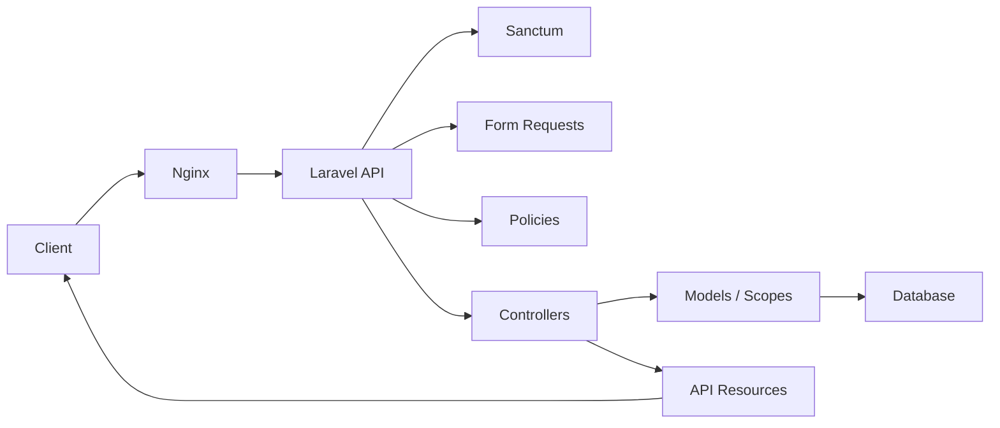
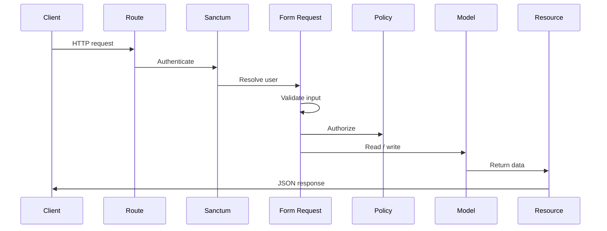
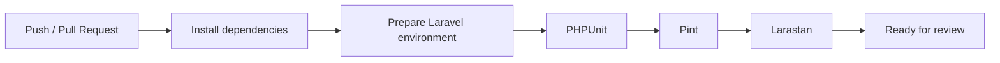
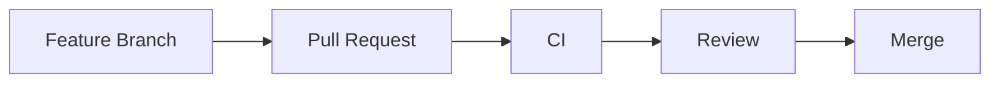

# CareerTrack API

> A REST API for tracking job applications with user-scoped data, documented endpoints, automated quality checks, and a reproducible development environment.

[](../../actions/workflows/ci.yml)


CareerTrack API centralizes the job application workflow behind a structured HTTP interface.

It is designed as a focused backend service: authenticated, user-scoped, validated, tested, documented, and ready to run locally with Docker.

|  |  |
| --- | --- |
| **Domain** | Job application tracking |
| **Interface** | REST API |
| **Authentication** | Bearer tokens with Laravel Sanctum |
| **Documentation** | OpenAPI generated with Scramble |
| **Local runtime** | Docker Compose with PHP-FPM, Nginx, and MySQL |
| **Quality gates** | PHPUnit, Larastan, Laravel Pint, GitHub Actions |

## Product Summary

Job applications are often tracked across spreadsheets, notes, inboxes, and memory.

CareerTrack API provides a small, explicit backend for that workflow:

- Keep applications in one place.
- Track status changes over time.
- Store source, salary range, notes, dates, and next steps.
- Retrieve user-scoped statistics.
- Keep each user's data isolated.

## Project Highlights

| Area | Implementation |
| --- | --- |
| API design | RESTful routes with JSON responses |
| Authentication | Token-based access with Laravel Sanctum |
| Authorization | Ownership enforced through policies |
| Validation | Form Requests for input rules and request authorization |
| Serialization | API Resources for stable response payloads |
| Querying | Validated filters, sorting, and pagination |
| Documentation | OpenAPI documentation generated from the Laravel app |
| Development | Dockerized PHP-FPM, Nginx, and MySQL environment |
| Quality | CI, automated tests, static analysis, and style checks |

## Architecture Overview



## Features

### Authentication

| Capability | Endpoint |
| --- | --- |
| Register user | `POST /api/auth/register` |
| Login user | `POST /api/auth/login` |
| Logout current token | `POST /api/auth/logout` |

### Job Applications

- Create, list, view, update, and delete applications.
- Enforce ownership for user-specific records.
- Track status through a PHP enum.
- Store optional salary range, source, notes, location, and dates.
- Support partial updates through `PATCH`.

### Filtering and Pagination

The application listing supports validated query parameters.

| Parameter | Purpose |
| --- | --- |
| `status` | Filter by application status |
| `company` | Filter by company name |
| `from` | Filter by application date lower bound |
| `to` | Filter by application date upper bound |
| `sort_by` | Sort by allowed fields |
| `sort_direction` | Sort ascending or descending |
| `per_page` | Control page size within validation limits |

Paginated responses use Laravel's standard JSON structure:

- `data`
- `links`
- `meta`

### Statistics

The statistics endpoint returns authenticated-user data only.

| Metric | Description |
| --- | --- |
| `total` | Total applications for the current user |
| `by_status` | Count grouped by application status |
| `upcoming_next_steps` | Count of future next-step dates |

## Quick Start

### Docker

Requirements:

- Docker
- Docker Compose

```bash
cp env.docker.example .env
docker compose up -d
docker compose exec app composer install
docker compose exec app php artisan key:generate
docker compose exec app php artisan migrate
```

Open:

```text
http://localhost:8080
```

### Local Development

Requirements:

- PHP 8.3
- Composer
- Configured database connection

```bash
composer install
cp .env.example .env
php artisan key:generate
php artisan migrate
php artisan serve
```

Open:

```text
http://localhost:8000
```

## API Documentation

OpenAPI documentation is generated with Scramble.

| Environment | UI | JSON |
| --- | --- | --- |
| Docker | `http://localhost:8080/docs/api` | `http://localhost:8080/docs/api.json` |
| Local | `http://localhost:8000/docs/api` | `http://localhost:8000/docs/api.json` |

Protected endpoints use Bearer token authentication:

```http
Authorization: Bearer <token>
```

## Endpoints

### Authentication

| Method | Endpoint | Description |
| --- | --- | --- |
| `POST` | `/api/auth/register` | Register a new user |
| `POST` | `/api/auth/login` | Authenticate a user |
| `POST` | `/api/auth/logout` | Revoke the current token |

### Job Applications

| Method | Endpoint | Description |
| --- | --- | --- |
| `GET` | `/api/applications` | List authenticated user's applications |
| `POST` | `/api/applications` | Create an application |
| `GET` | `/api/applications/{jobApplication}` | View an application |
| `PUT/PATCH` | `/api/applications/{jobApplication}` | Update an application |
| `DELETE` | `/api/applications/{jobApplication}` | Delete an application |

### Statistics

| Method | Endpoint | Description |
| --- | --- | --- |
| `GET` | `/api/stats` | Get authenticated user's application statistics |

## Architecture

The application follows Laravel's conventional API structure and keeps responsibilities close to framework primitives.

| Layer | Responsibility |
| --- | --- |
| Controllers | Coordinate HTTP behavior and return responses |
| Form Requests | Validate input and authorize request-level access |
| Policies | Enforce ownership and authorization rules |
| Models | Represent persistence, relationships, casts, and query scopes |
| API Resources | Define public JSON response shape |
| Enums | Represent bounded domain states |
| Sanctum | Authenticate API tokens |

### Request Flow



### Key Application Components

| Component | Files |
| --- | --- |
| API controllers | `app/Http/Controllers/Api` |
| Request validation | `app/Http/Requests` |
| Response resources | `app/Http/Resources` |
| Authorization | `app/Policies/JobApplicationPolicy.php` |
| Domain state | `app/Enums/ApplicationStatus.php` |
| Persistence | `app/Models/JobApplication.php`, `app/Models/User.php` |
| Routes | `routes/api.php` |

## Engineering Practices

The project is organized around a few operating principles.

### Keep Behavior Reviewable

Changes are expected to move through focused branches and pull requests.

That keeps implementation scope small enough to review and makes integration decisions visible.

### Make Quality Checks Repeatable

The same checks can be run locally and in CI.

This avoids relying on individual editor settings or manual review to catch formatting, type, or regression issues.

### Test the Public Contract

Feature tests exercise HTTP behavior rather than implementation details.

The suite verifies authentication, authorization, validation, filtering, pagination, statistics, and documentation availability from the perspective of an API client.

### Keep Documentation Close to Code

OpenAPI documentation is generated from the Laravel application using Scramble.

The goal is to reduce drift between documented behavior and implemented behavior.

### Prefer Framework-Aligned Boundaries

The API uses Laravel-native boundaries before introducing additional abstraction:

- Form Requests for validation.
- Policies for authorization.
- Resources for serialization.
- Eloquent scopes for query behavior.
- Sanctum for token authentication.

### Make Local Setup Predictable

Docker Compose provides a consistent development runtime without replacing the standard Laravel workflow.

The environment is intentionally scoped to development.

## Testing & Quality

The test suite uses PHPUnit with Laravel's testing tools.

During tests, the project uses SQLite in memory for fast, isolated execution.

| Area | Covered behavior |
| --- | --- |
| Authentication | Register, login, failed login, logout, guest protection |
| Applications CRUD | Create, list, view, update, delete |
| Ownership | Users cannot access or mutate other users' applications |
| Validation | Required fields, enum status, salary rules, date rules, partial PATCH |
| Filtering | Status, company, sorting, pagination, invalid query parameters |
| Statistics | User-scoped totals, status counts, upcoming next steps |
| Documentation | OpenAPI UI and JSON availability |

## Quality Gates

Before changes are integrated, GitHub Actions runs:

```bash
composer analyse
vendor/bin/pint --test
php artisan test
```



## Development Commands

### Docker

| Task | Command |
| --- | --- |
| Start services | `docker compose up -d` |
| View services | `docker compose ps` |
| Run migrations | `docker compose exec app php artisan migrate` |
| Run tests | `docker compose exec app php artisan test` |
| Run static analysis | `docker compose exec app composer analyse` |
| Check formatting | `docker compose exec app vendor/bin/pint --test` |

### Local

| Task | Command |
| --- | --- |
| Run migrations | `php artisan migrate` |
| Run tests | `php artisan test` |
| List routes | `php artisan route:list` |
| Run static analysis | `composer analyse` |
| Check formatting | `vendor/bin/pint --test` |
| Format code | `vendor/bin/pint` |

## Project Structure

```text
app/
  Enums/
  Http/
    Controllers/Api/
    Requests/
    Resources/
  Models/
  Policies/

config/
  scramble.php
  sanctum.php

database/
  factories/
  migrations/
  seeders/

docker/
  nginx/
  php/

routes/
  api.php

tests/
  Feature/
    Auth/
    Documentation/
    JobApplications/
    Stats/
  Unit/

.github/
  workflows/
```

## Configuration

### Environment Files

| File | Purpose |
| --- | --- |
| `.env.example` | Default local Laravel environment |
| `env.docker.example` | Docker-oriented local environment |

### Docker Services

| Service | Responsibility |
| --- | --- |
| `app` | PHP 8.3 FPM, Composer, Laravel runtime |
| `nginx` | Serves the Laravel `public` directory |
| `mysql` | MySQL 8 database with persistent volume and healthcheck |

## Roadmap

Near-term improvements that fit the current scope:

- Add request and response examples to OpenAPI documentation.
- Document deployment steps for a single VPS target.
- Add API versioning when the contract requires long-term compatibility.
- Extend statistics after new product requirements are defined.

## Contributing

Use a pull request workflow.



1. Create a focused feature branch.
2. Keep changes small and reviewable.
3. Open a pull request.
4. Wait for CI to pass.
5. Address review feedback.
6. Merge after approval.

## Design Goals

CareerTrack API is intentionally small, explicit, and framework-aligned.

The project favors:

- Clear HTTP behavior over hidden abstraction.
- Laravel conventions over unnecessary patterns.
- User data isolation as a first-class requirement.
- Tests that protect observable API behavior.
- Documentation and automation that reduce maintenance cost.

## License

This project is open-sourced software licensed under the MIT license.
